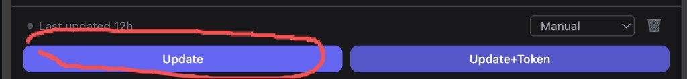
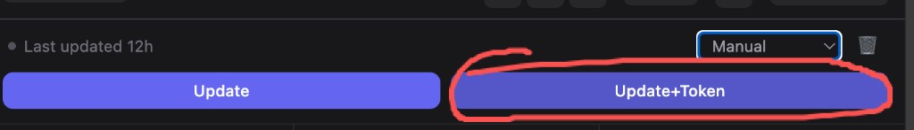
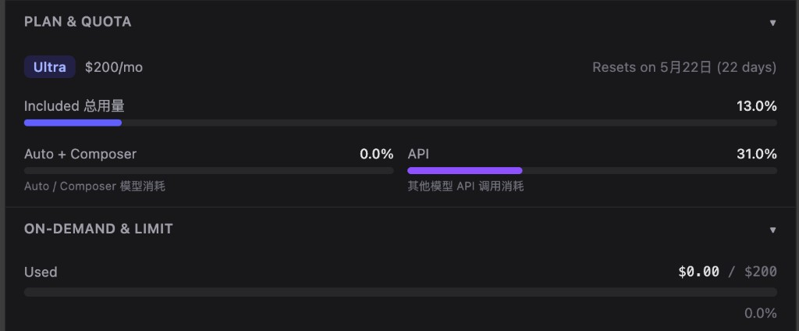
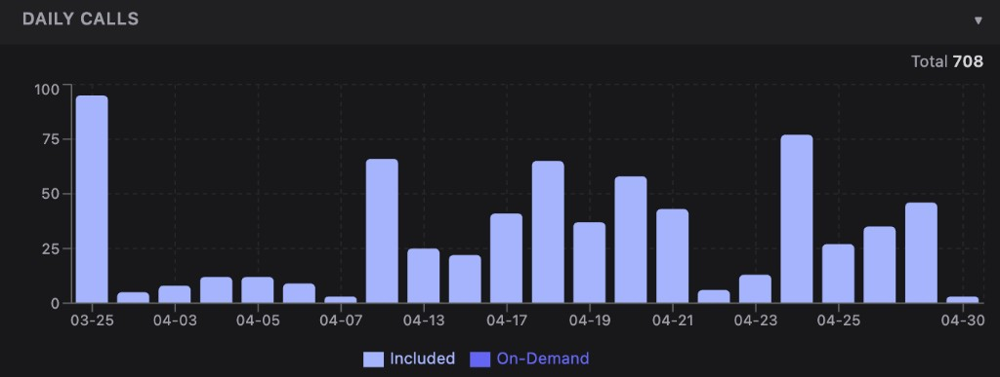
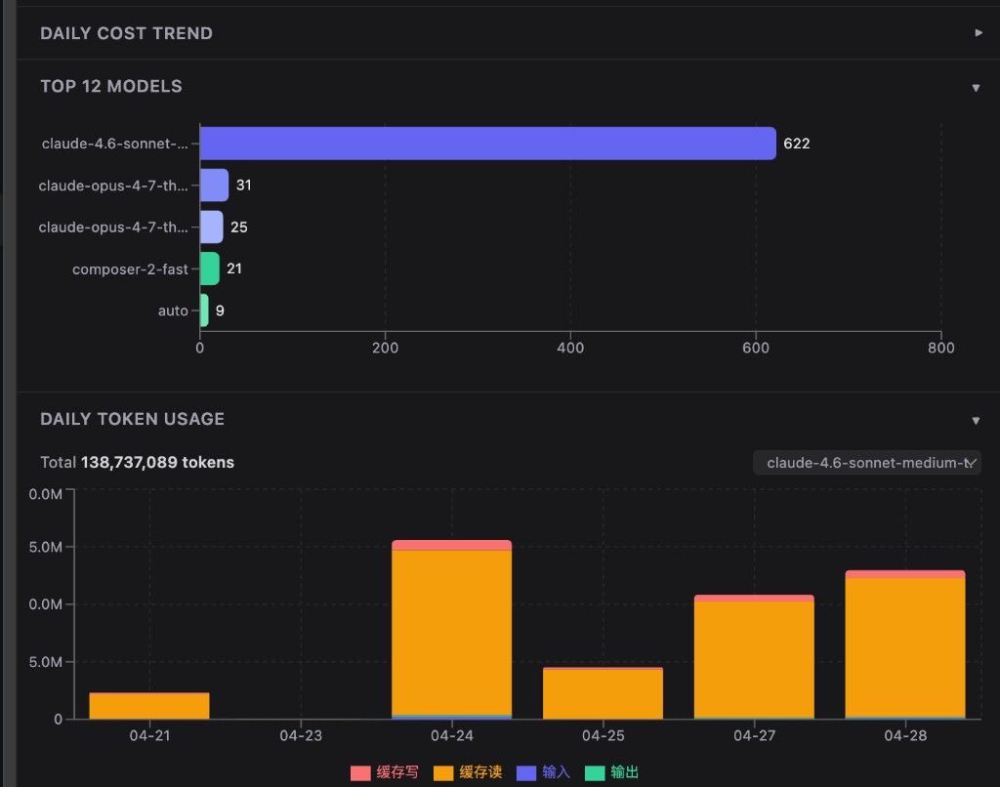

# Cursor Spending Monitor

> 可视化你的 Cursor.com API 用量与消费 — 完全本地运行，无需 API Key，无服务器。

[](https://chromewebstore.google.com/detail/cursor-spending-monitor/ejhbbdfjonjoacmggekjjpilaeplbnek)
[](https://microsoftedge.microsoft.com/addons/detail/cursor-spending-monitor/hcmkkgbdgaoahocjkbnhedlgcjhfnmeb)
[](LICENSE)

[English](README.md) · 中文

---

## 🚀 安装（一键直达）

| 浏览器 | 链接 |
|---|---|
| **Google Chrome** | [从 Chrome 应用商店安装](https://chromewebstore.google.com/detail/cursor-spending-monitor/ejhbbdfjonjoacmggekjjpilaeplbnek) |
| **Microsoft Edge** | [从 Edge 加载项安装](https://microsoftedge.microsoft.com/addons/detail/cursor-spending-monitor/hcmkkgbdgaoahocjkbnhedlgcjhfnmeb) |

> 无需账号，无需 API Key。点击「添加至 Chrome / Edge」即可完成安装。

---

## 📖 使用教程

### 第一步 — 点击 **Update** 快速获取每日用量



点击左侧的 **Update** 按钮，插件会自动读取你的 Cursor 账单页面，几秒内即可看到：
- 每天调用了多少次 API
- 哪几天用量高、哪几天清闲
- 当前套餐额度消耗进度

### 第二步 — 点击 **Update+Token** 获取完整 Token 明细



点击右侧的 **Update+Token** 按钮，会在 Update 的基础上，额外抓取每条记录中隐藏的 Token 详情。  
需要约 **3~4 分钟**（实时更新，抓取过程中可以看到数据逐行出现），完成后可以看到：
- 每次调用的 **CacheR / CacheW / Input / Output** 精确 Token 数
- 基于 Token 数粗略估算的**每次调用费用**
- 真正搞清楚账单为什么这么贵！

> ⚠️ Update+Token 会逐行悬停才能读取隐藏数据，这就是为什么需要更长时间。数据是实时更新的，耐心等待即可。

---

## 📊 你能看到什么

### 套餐 & 额度 — 一眼看清你的订阅状态



显示当前套餐（如 Ultra $200/月）、重置日期，以及各项额度的使用进度：
- **Included 总用量** — 套餐内额度整体消耗（如 13%）
- **Auto + Composer** — Auto/Composer 模型消耗占比
- **API** — 直接 API 调用消耗占比（如 31%）
- **ON-DEMAND & LIMIT** — 按需计费消费金额 vs 上限（如 $0.00 / $200）

---

### 每日调用量 — 看清哪天用量爆了



每日 API 调用次数堆叠柱状图，区分：
- **Included**（套餐内额度覆盖的调用）
- **On-Demand**（超出额度后按 Token 计费的调用）

右上角显示统计周期内的总调用次数。一眼看出哪天写代码写到停不下来。

---

### 模型分布 + 每日 Token 用量 — 找出预算黑洞



**Top 12 Models** — 横向柱状图，展示各模型调用次数。  
上图示例中：`claude-4.6-sonnet` 共调用 622 次，占 708 次总调用的 88%。

**Daily Token Usage** — 每日 Token 用量堆叠图，细分 4 个维度：

| 颜色 | 指标 | 含义 |
|---|---|---|
| 🟠 橙色 | **CacheR**（缓存读） | 从提示缓存中读取的 Token，最便宜 |
| 🔴 红色 | **CacheW**（缓存写） | 写入提示缓存的 Token |
| 🔵 蓝色 | **Input**（输入） | 发送给模型的新鲜输入 Token |
| 🟢 绿色 | **Output**（输出） | 模型生成的 Token，最贵 |

右上角下拉框可切换不同模型，单独查看其 Token 消耗结构。

---

## ✨ 完整功能列表

- 📊 **用量仪表盘** — 每日调用数、消费趋势、额度进度条
- 💰 **按需费用追踪** — 每次请求费用，与 cursor.com 账单完全一致
- 🧾 **详细记录表格** — 日期、类型、模型、CacheR/CacheW/Input/Output Token 数、每次费用
- 📈 **4 种图表** — 每日调用、每日费用、每日 Token（4 项指标）、模型分布
- 👤 **多账号支持** — 按账号严格隔离数据，切换账号自动识别
- 📤 **CSV 导出** — 一键导出全部记录，Excel 兼容（UTF-8 BOM）
- 🌐 **中英文界面** — 跟随浏览器语言自动切换
- 🌙 **深色 / 浅色模式** — 跟随系统或手动切换
- 🔒 **100% 本地** — 无服务器、无 API Key、不收集任何数据

---

## 🔒 隐私说明

**你的数据永远不会离开本机。**

- 所有数据存储在本机的 `chrome.storage.local` 中
- 不向任何外部服务器发送网络请求
- 无埋点、无追踪、无遥测

查看完整 [隐私政策](https://troublebaker.github.io/Cursor-Spending-Monitor/docs/privacy-policy.html)。

---

---

## 🛠 从源码构建 *(仅限开发者)*

> **普通用户请直接使用上方的一键安装链接，无需阅读此节。**

```bash
# 1. 克隆仓库
git clone https://github.com/troublebaker/Cursor-Spending-Monitor.git
cd Cursor-Spending-Monitor/cursor监控插件/wxt-dev-wxt

# 2. 安装依赖
pnpm install

# 3. 构建
pnpm build

# 4. 在 Chrome 中加载
# 打开 chrome://extensions → 开启「开发者模式」→「加载已解压的扩展程序」→ 选择 .output/chrome-mv3/
```

---

## 🤝 贡献

欢迎提交 PR 和 Issue！大改动请先开 Issue 讨论。

---

## 📄 许可证

MIT © [CodeJames](https://github.com/troublebaker) · [@CodeJames333025](https://x.com/CodeJames333025)
